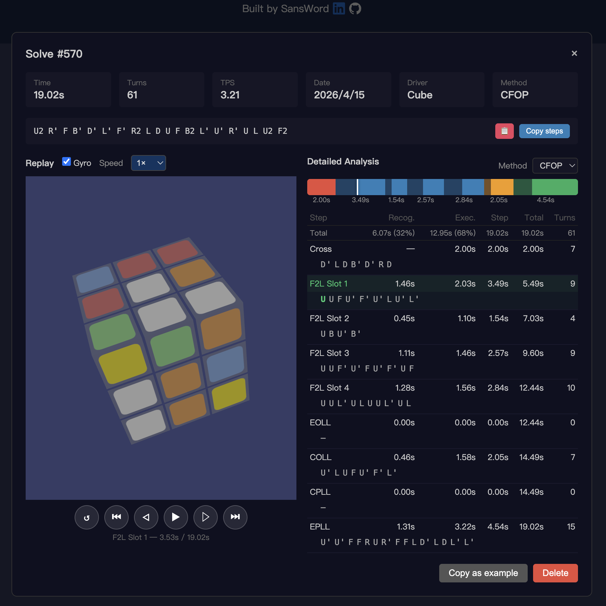

# Cost analysis for a feature on Opus 4.7 — why the API bill was the cheap part

> *Same model, bigger feature. Cost-per-story-point was nearly flat in dollars. It nearly tripled in my attention.*

← [Back to Index](../../README.md) · Previous in series: [Sonnet 4.6 vs Opus 4.7](../claude-code-model-comparison/comparison.md)

---

## TL;DR

`acubemy-import` on Opus 4.7 cost **~$247** and **~5h 16m** of engaged time across three clean-context sessions. Per story point, dollars were flat (**1.06×**) vs a ~5-point feature on the same model; attention nearly tripled (**2.95×**). [Details →](#headline-numbers)

- **Run each phase in its own Claude Code session.** `/exit`-and-relaunch between brainstorm, plan, and execute catches drift early and makes per-phase cost legible. [How →](#setup-same-model-three-clean-context-sessions)
- **Delegate to subagents — for cost and review.** Haiku absorbed mechanical work (**~$35 saved**); reviewer subagents, opening on fresh context, caught bugs the main loop had stopped seeing. [How →](#why-delegate-cheaper-tokens-cleaner-review)
- **Story points as a cross-feature yardstick.** Story points made "same-model, different-size" comparable at all. [How I used them →](#cost-per-story-point)
- **Ask Claude to parse the session JSONLs.** Every cost number in this article came from that prompt, not manual accounting. [Copy-pasteable prompt →](#a-reusable-cost-analysis-prompt)
- **Untried — mixing models across phases.** Three variants I haven't run yet — Opus brainstorm+plan / Sonnet execute, Opus brainstorm / Sonnet plan+execute, or Sonnet throughout. [Variants →](#one-untried-mixing-models-across-phases)

**Bonus.** Add a Review Protocol snippet to your `~/.claude/CLAUDE.md` → reviews get cheaper and cleaner. [Why and how →](#why-delegate-cheaper-tokens-cleaner-review)

BTW, writing this analysis cost about $177.94 and ~4h 45m of engaged time — ~72% of the $247 feature it analyzes.

---

This is a follow-up to the [previous article](../claude-code-model-comparison/comparison.md), which compared Sonnet 4.6 vs Opus 4.7 on the same small feature. This one takes the other axis: **same model, bigger feature.** I built `acubemy-import` on Opus 4.7 across three sessions — brainstorm, plan, and execute, each in its own clean-context Claude Code session — and asked Claude to analyze the session logs afterward.

The feature cost **3.4× the API dollars** of the smaller one in the [previous article](../claude-code-model-comparison/comparison.md) — roughly what you'd expect for ~3× the output.

## Project context

[`sans_cube`](https://github.com/SansWord/sans_cube) is a Rubik's cube solve analyzer for speedcubers. It connects to smart cubes via Web Bluetooth, records solves in real time, and breaks each solve down phase-by-phase (CFOP and Roux). Stack: React 19 + TypeScript + Vite + Three.js, with optional Firebase Firestore cloud sync.



> **▶ Try it live:** [sansword.github.io/sans_cube](https://sansword.github.io/sans_cube/#solve--2) opens an example solve — phase breakdown, 3D replay, and move history, no smart cube needed. Chromium browser (Chrome / Edge) required.

## The feature and why I built it

**Acubemy-import** is a bulk-import pipeline: take a JSON export from Acubemy (a solve tracker other speedcubers already use), preview the import in a modal, verify each solve is solvable, and write everything into `sans_cube`'s schema-versioned local storage.

Three reasons to build it:

1. **Single source of truth.** I had **~700 solves on Acubemy** that weren't visible in `sans_cube`.
2. **Better Roux breakdown.** `sans_cube` splits Roux's LSE phase into **CMLL + EO + (UR+UR) + EP** — finer than Acubemy's — but only on solves it recorded itself. Importing gets me that analysis on old history.
3. **Curiosity.** I've built plenty of backend data migrations; never the user-facing version of one. Acubemy-import let me feel that work from the other end.

## Setup: same model, three clean-context sessions

All three phases ran on **Claude Opus 4.7** in the main loop — no model switch mid-feature. Each phase lived in its own Claude Code session:

- **Brainstorm** → write a [design doc](https://github.com/SansWord/sans_cube/blob/main/docs/superpowers/specs/2026-04-18-acubemy-import-design.md)
- **Plan** → break the design into [implementation tasks](https://github.com/SansWord/sans_cube/blob/main/docs/superpowers/plans/2026-04-18-acubemy-import.md)
- **Execute** → ship the code

Between phases **I ran `/exit` and started a fresh session**, carrying over only the written doc from the previous phase. No accumulated cache, no lingering conversation — each session started with an empty context and read the prior-phase artifact as its first input.

The three-phase pattern comes from the [Superpowers plugin](https://github.com/obra/superpowers), which enforces `brainstorm → plan → execute` on non-trivial features. The `/exit`-and-relaunch discipline between phases isn't a Superpowers default — I layered it on top via a personal `CLAUDE.md` reminder. Net effect: three independent session logs, which is why the cost decomposes cleanly per phase in the numbers below.

<details>
<summary><strong>The exact phase-handoff snippet from my global <code>CLAUDE.md</code></strong> (click to expand)</summary>

Copy everything between the fences below into your own `~/.claude/CLAUDE.md` to get the same per-phase session isolation:

````markdown
## Phase Handoff Protocol (Superpowers)

After completing any of these phases — brainstorming, write-plan, or execute-plan — always:

1. Confirm which file was saved and its exact path
2. Display this message before doing anything else:

```
Phase complete!
Saved to: [filename]
Run `/exit` to close this session, then launch a new Claude Code session for the next phase. Only the written doc from this phase carries over.
In the new session, reference the file above.

Example prompt for next phase:
    [next-phase-prompt]
```

Where `[next-phase-prompt]` is filled in based on the completed phase:
- After **brainstorming** → `Write a plan based on the brainstorm in [filename]`
- After **write-plan** → `Execute the plan in [filename]`
- After **execute-plan** → `Review the implementation from [filename] and verify it's complete`

3. Do not proceed to the next phase in the same session.
````

</details>

> **My take.** I keep using this format on my own projects. The specific plugin matters less than the pattern: separate design-thinking from execution, commit to a written doc between phases, and start each phase with a clean context. That's what catches drift early and keeps designs trackable.

### Why Opus 4.7 across all three phases

Opus 4.7 had just released, and I wanted to feel the difference from the default (Sonnet 4.6) on work larger than the small feature in the [previous article](../claude-code-model-comparison/comparison.md). That article compared the two models on the same small feature. This one holds the model constant on a bigger one — the other axis of the cost question.

> **My take.** Honestly, the clarifying questions felt like more, and the implementation tasks felt more tedious than I remembered from Sonnet 4.6. But I couldn't tell if that was the new model or just the bigger feature — which is one reason I reached for story points later as a cross-feature yardstick.

## Headline numbers

Total cost of building `acubemy-import` on Opus 4.7, across all three phases:

- **~$247 in API dollars.**
- **~46% of a single Claude Code Max 5x session** (plan-limit).
- **~5 hours 16 minutes of engaged time** — time I was actually at the keyboard, excluding hours the session sat idle while I stepped away.

Per-phase breakdown:

| Phase | API cost | Engaged time |
|---|---:|---:|
| Brainstorm (design) | $103.54 | ~3h 06m |
| Plan | $27.87 | ~57m |
| Execute (implementation + subagents) | $115.49 | ~1h 13m |
| **Total** | **~$246.90** | **~5h 16m** |

The numbers came from asking Claude to parse the session JSONL files and apply Anthropic's published per-token rates — not from manual accounting. The exact prompt is under [A reusable cost-analysis prompt](#a-reusable-cost-analysis-prompt) below if you want to run the same analysis on your own features.

Full token breakdown, subagent-level detail, and the "active time vs wall-clock" methodology live in the data appendix: [`cost-acubemy-import.md`](./cost-acubemy-import.md).

## Cost per story point

To compare two features of different sizes, I need a unit. Lines of code rewards verbosity; design-doc length rewards overthinking. I reached for **story points** — the same complexity yardstick sprint teams use at planning. The freeform-method feature in the [previous article](../claude-code-model-comparison/comparison.md) came out to **~5 points**; acubemy-import to **~16 points** — roughly a parser for Acubemy's JSON export, a schema transform into `sans_cube`'s internal shape, tests plus per-solve solvability verification, and a preview-and-edit UI with exception handling.

On the same model (Opus 4.7), here's what each point cost:

| Per-point cost | Freeform-method (5 pts, Opus 4.7) | Acubemy-import (16 pts, Opus 4.7) | Ratio |
|---|---:|---:|---:|
| API dollars | $14.6 ($73 total) | $15.4 ($247 total) | **1.06× — flat** |
| Engaged time | 6.7 min (33 min total) | 19.8 min (5h 16m total) | **2.95× — super-linear** |

Per-point API dollars barely moved — output roughly scales with input on the same model, so 3× the feature costs ~3× the dollars, and per-point cost stays flat. Per-point **engaged time** nearly tripled. The larger feature demanded disproportionately more of my attention per unit of complexity — more branches to reason about, more ambiguous design calls, more places where "is this right?" stopped Claude and required me to answer.

Phase-level breakdown and the per-token math behind these numbers lives in the data appendix: [`cost-acubemy-import.md`](./cost-acubemy-import.md).

> **My take.** The asymmetry didn't surprise me, and it also doesn't change what I build. Acubemy-import is an atomic feature — I wasn't going to ship it in four slices just to keep per-session attention lower. What *did* click was realizing I had a method to compare two completely different features at all. Pairing story points with JSONL-parsed cost numbers turned "same-model, different-feature-size" into an answerable question.

## Why delegate: cheaper tokens, cleaner review

Subagents were an execute-phase thing. Brainstorm and plan ran on Opus 4.7 in the main loop with no subagents — reasoning about design and producing the written artifacts is exactly the work that wants one deep context. Once implementation kicked off, that changed: across the execute phase, Claude dispatched **31 subagents** — 19 to Haiku 4.5, 12 to Opus 4.7.

I didn't pick those routings. The Superpowers `subagent-driven-development` skill uses named agent types, and each type's default model decides where the work lands: general-purpose agents (file reads, greps, mechanical transforms) default to Haiku; code-reviewer agents inherit the parent model, so they ran on Opus.

Two effects fall out of that:

**Cheaper tokens.** Routing mechanical work to Haiku — searching across the codebase, applying straightforward transforms, extracting data from fixtures — saved roughly **$35 (~23% off)** on the implementation phase versus running the same prompts on Opus. The main loop kept the hard reasoning; Haiku absorbed the grinding.

**Cleaner review.** Each reviewer subagent opens on a fresh context, reads only the implementation diff and the plan, and reports back. That's structurally close to peer review — the reviewer hasn't spent 40 turns convincing themselves the approach is fine, so they push back more often. Two short examples from the execute phase:

- **[Task 2](https://github.com/SansWord/sans_cube/blob/main/docs/superpowers/plans/2026-04-18-acubemy-import.md#task-2-add-flush-to-colormovetranslator-for-batch-use) — a [Task 1](https://github.com/SansWord/sans_cube/blob/main/docs/superpowers/plans/2026-04-18-acubemy-import.md#task-1-add-importedfrom-field-to-solverecord) field disappeared between commits.** Reviewer diffed against the prior commit and spotted that a field added one task earlier was now gone. Main loop hadn't noticed. Caught in-flight, before the commit landed.
- **[Task 7](https://github.com/SansWord/sans_cube/blob/main/docs/superpowers/plans/2026-04-18-acubemy-import.md#task-7-parseexport--top-level-orchestrator) — validation check was incomplete.** The main loop confirmed each record's required fields were *present*, but didn't check their types. A malformed export could have slipped through and quietly corrupted saved data. Reviewer flagged it; fix: [`refactor: tighten type narrowing in parseExport`](https://github.com/SansWord/sans_cube/commit/9015657).

I've since layered this habit into my global `CLAUDE.md` — a short Review Protocol reminder that defaults *any* review task (code against a plan, drafts against a spec, investigations) to a fresh-context Agent, not just the Superpowers per-task implementation pattern. Same insight, applied more broadly.

<details>
<summary><strong>The Review Protocol snippet from my global <code>CLAUDE.md</code></strong> (click to expand)</summary>

Copy everything between the fences below into your own `~/.claude/CLAUDE.md` to default review tasks to a fresh-context subagent:

````markdown
## Review Protocol

When reviewing completed work against a plan or spec (finished feature, drafted article, implementation phase, etc.), default to dispatching a subagent via the Agent tool rather than reviewing from the main loop. The main loop has accumulated context from building the work and is structurally primed to think it's fine; a fresh-context reviewer catches things the main loop has stopped noticing.

Subagent type by task:
- Code against a plan → `superpowers:code-reviewer`
- Writing / docs / content against a spec → `general-purpose` with explicit editorial instructions
- Research / investigation → `general-purpose` or `Explore`

Give the reviewer both the work and the spec. Ask for structured findings per dimension (verdict + brief reason), not free-form commentary.
````

</details>

I can't quantify this effect from JSONLs — "how often did reviewers catch things" isn't a metric the tokens expose. But across nine reviewer passes, findings like these were routine, and they consistently came from the reviewer, not the main loop.

These savings were **automatic** — Superpowers' agent-type defaults did the routing without me choosing. Deliberately using different models across phases is the natural next experiment; I didn't try it on this feature. [Variants in One untried below](#one-untried-mixing-models-across-phases).

> **My take.** The $35 saved is nice. The peer-review effect is why I'll keep using this — a reviewer opening on a fresh context catches things a main loop deep in the implementation has stopped seeing. Cost is the bonus; correctness is the reason.

## Takeaways

Two things worth copying out — the prompt I use for this kind of cost analysis, and one experiment I haven't tried yet.

### A reusable cost-analysis prompt

Every cost number in this article came from giving Claude the project's JSONLs and asking it to parse usage fields and apply Anthropic's rate card — not from manual accounting. Adapt paths and models to your own project.


**Cost-analysis prompt** (copy-paste into a fresh Claude Code session)

```
I want a cost analysis for a multi-session Claude Code feature.

Sessions live at ~/.claude/projects/<project-id>/<session-uuid>.jsonl
(subagent JSONLs under the matching <session-uuid>/subagents/ folder).

Per session, extract tokens from usage fields (input, output, cache_read,
cache_creation.ephemeral_5m, cache_creation.ephemeral_1h) and apply
Anthropic's published per-MTok rates for each model involved.

Also compute "engaged time" = sum of inter-event deltas where gap ≤ 10 min
(to exclude multi-hour idle pauses).

Output a markdown summary:
- Per-phase table: model, tokens, $ cost, engaged time
- Subagent effect: counterfactual if all subagent tokens had billed at the
  main-loop model's rate
- Methodology caveats (cache dynamics, rate-card version, any assumptions)

Flag uncertainty honestly. Don't invent numbers.
```


### One untried: mixing models across phases

Every phase already runs in its own session, so switching models between phases is a no-op — just launch the next session on the model you want. I ran Opus 4.7 through all three phases on this feature; I haven't tested alternatives. A few worth comparing next time:

- **Opus brainstorm + plan, Sonnet execute.** The [`comparison.md` hybrid suggestion](../claude-code-model-comparison/comparison.md#hybrid-worth-trying-next-time). Counterfactual math: ~35% savings estimated.
- **Opus brainstorm, Sonnet plan + execute.** Keep Opus only for the most open-ended phase (design). Cheaper still than the first option; worth trying on features where the plan is mostly mechanical breakdown.
- **Sonnet throughout.** The default. Worth running just to see how much of Opus's per-feature value actually survives as measurable output on this kind of codebase work.

If you try one of these on your own project, I'd be curious to compare notes.

## The meta-cost

Writing this analysis cost about **$177.94** in API dollars and **~4h 45m** of engaged time — **~72%** of the $247 feature it's analyzing.

The API bill was the cheap part here too.

---

## About

**Project:** [github.com/SansWord/sans_cube](https://github.com/SansWord/sans_cube) — try the live app at [sansword.github.io/sans_cube](https://sansword.github.io/sans_cube/#solve--2) (opens an example solve).

**Author:** SansWord — [LinkedIn](https://www.linkedin.com/in/sansword/). A data platform builder with 13 years of experience. Reach out if you'd like to talk about this comparison, speedcubing, or web apps built with Claude Code.

← [Back to Index](../../README.md)
